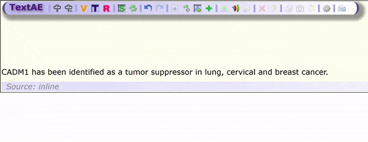

Extending TextAE for annotation of non-contiguous entities
==========================================================

This is a fork of the [TextAE annotation tool repo](https://github.com/pubannotation/textae). It's a tool to annotate text with entities and relations between those entities. As part of the [BLAH6 hackathon](https://blah6.linkedannotation.org/), we started a project to add the ability to annotate non-contiguous entities (like the ones below) with the interface and data model. This repo contains the changes.

We also did some analysis using PubMed and PubMed Central to try to quantify one type of non-contiguous relations. The code for that can be found in the [analysis/](https://github.com/jakelever/textae/tree/stable/4/analysis) directory.

To build and use the code, we direct you to the documentation in the [original repo](https://github.com/pubannotation/textae).

**Fig:** Lung and cervical cancer terms are non-contiguous entities but can be annotated with the new Add subspan functionality from the toolbar

Annotation
----------

The animation below shows two non-contiguous entities being annotated and then linked by relations. The steps are described below.

- Select the first one of an entity
- Enable the subspan mode on the toolbar (the green cross)
- Select the next span to be added to the entity
- Disable the subspan mode on the toolbar.

